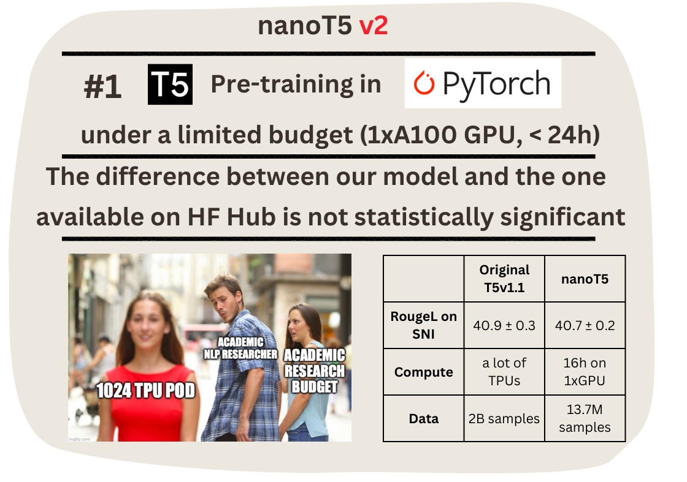
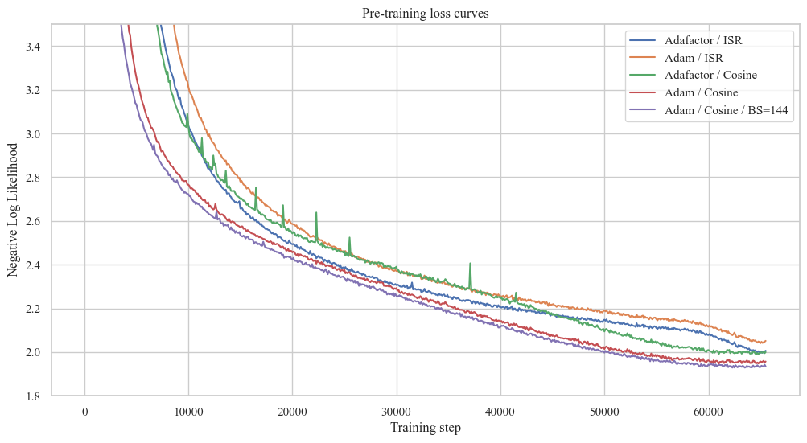
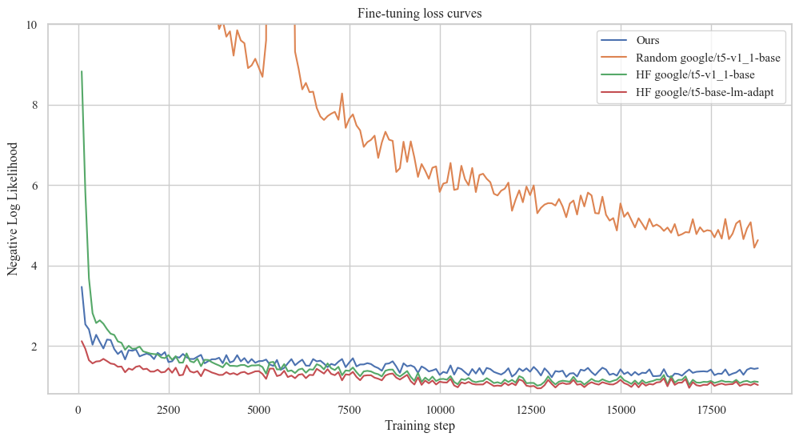
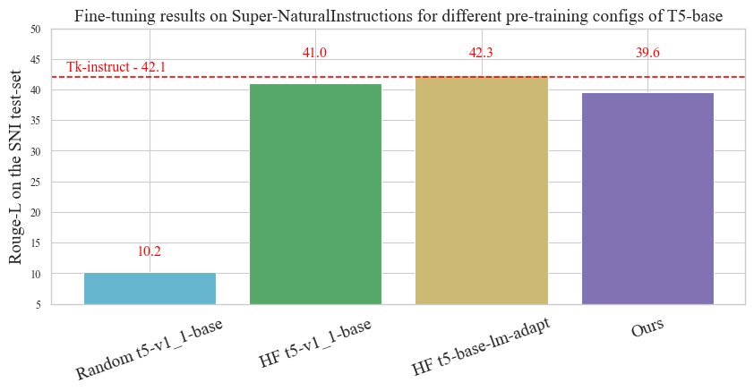

[](https://zenodo.org/badge/latestdoi/611282680)

# nanoT5 (Encoder-Decoder / Pre-training + Fine-Tuning)



[**TLDR**](#tldr) | [**Motivation**](#motivation) | [**Setup**](#setup) | [**References**](#references) | [**Conclusions**](#conclusions) | [**Issues**](#issues)

## TLDR:

This repository contains the code to reproduce the pre-training of a "Large Language Model" (T5) under a limited budget (1xA100 GPU, ~20 hours) in PyTorch. We start from the randomly initialised T5-base-v1.1 (248M parameters) model implemented in HuggingFace. Next, we pre-train it on the English subset of the C4 dataset and then fine-tune it on Super-Natural Instructions (SNI). 

**In ~20 hours on a single GPU, we achieve ~40 RougeL on the SNI test set, compared to ~42 RougeL of the original model available on HuggingFace Hub and pretrained through "a combination of model and data parallelism [...] on slices of Cloud TPU Pods", each with 1024 TPUs.**

Our core contribution is not the T5 model itself, which follows the HuggingFace implementation. Instead, we optimise everything else in the training pipeline to offer you a user-friendly starting template for your NLP application/research.

## Motivation

Despite the continuously increasing size of pretrained [Transformers](https://arxiv.org/pdf/1706.03762.pdf), the research community still needs easy-to-reproduce and up-to-date baselines to test new research hypotheses fast and at a small scale. 

A recent effort from Andrej Karpathy, the [nanoGPT](https://github.com/karpathy/nanoGPT) repository, enables researchers to pre-train and fine-tune GPT-style (Decoder-only) language models. On the other hand, [Cramming](https://github.com/JonasGeiping/cramming) implements the optimal BERT-style (Encoder-only) pre-training for limited-compute settings.

With [nanoT5](https://github.com/PiotrNawrot/nanoT5), we want to fill a gap (Community requests: [#1](https://github.com/huggingface/transformers/issues/18030) [#2](https://github.com/facebookresearch/fairseq/issues/1899) [#3](https://github.com/google-research/text-to-text-transfer-transformer/issues/172) [#4](https://discuss.huggingface.co/t/example-of-how-to-pretrain-t5/4129) [#5](https://github.com/huggingface/transformers/issues/5079)) of an accessible research template to pre-train and fine-tune T5-style (Encoder-Decoder) model. **To the best of our knowledge, it is the first attempt to reproduce T5 v1.1 pre-training in PyTorch (previously available implementations are in Jax/Flax).**

## 

**We created this repository for people who want to pre-train T5-style models by themselves and evaluate their performance on downstream tasks.** This could be for a variety of reasons:
- You are a researcher in academia with limited compute (like me), and you came up with a promising idea to modify the T5 model, so you need a pipeline to evaluate it;
- You have an in-house dataset that you think is more appropriate than the original pre-training data;
- You want to experiment with continued pre-training or want to build on the T5 pre-training objective.

**If you don't need to pre-train the T5 model, you'd be better off downloading the weights from HuggingFace Hub. Our checkpoints are worse because we work under limited compute.**

## 

In this project, we expose (for research purposes) and optimise everything in the training pipeline of T5 except from model implementation. **Most importantly, we base our code on PyTorch, since access to TPUs is limited.** Among others:
- **Dataset:** Downloading and preprocessing of the C4 dataset happens in parallel with the training of the model. The C4 dataset is > 300GB, so it takes a couple of hours to download it and even longer to preprocess it. This codebase does it on the fly without any detrimental effect on the training loss (we haven't observed it, although it might happen with an old CPU (< 8 core) or a slow internet connection). **As a result, you can start pre-training right after downloading and setting up this repository.**
- **Model Optimizer / LR Scheduler:** The original T5 uses a memory-efficient Adafactor optimizer. [A study on pre-training T5](https://huggingface.co/spaces/yhavinga/pre-training-dutch-t5-models), on the other hand, reports that training does not converge with AdamW. We analysed the source of this discrepancy with several ablations. Although there are many subtle differences between Adafactor and AdamW, what ensures the Adafactor convergence is [matrix-wise LR scaling by its root mean square (RMS)](https://github.com/huggingface/transformers/blob/main/src/transformers/optimization.py#L595). We augmented the AdamW implementation by RMS scaling and observed that it becomes **more stable during pre-training, achieves better validation loss, and is faster**.
- **Exposure and simplicity:** We try to balance the implementation of the training pipeline by keeping it customisable while retaining a sufficient level of abstraction. We use the [HuggingFace Accelerator](https://huggingface.co/docs/accelerate/index) to implement operations like Checkpoint Saving, Gradient Accumulation and moving tensors to the correct devices. We use [neptune.ai](https://neptune.ai) for experiment tracking and [hydra](https://hydra.cc/docs/intro/) for hyperparameter search. Apart from this, we expose the training loop, data preprocessing, etc.
- **Efficiency:** We enable TF32 operations (Ampere GPUs) by default, use PyTorch 2.0 compile, and utilise all optimisations listed in established optimisation tutorials [#1](https://huggingface.co/docs/transformers/perf_train_gpu_one) [#2](https://pytorch.org/tutorials/recipes/recipes/tuning_guide.html).

## Setup

### Environment & Hardware:

```
git clone https://github.com/PiotrNawrot/nanoT5.git
cd nanoT5
conda create -n nanoT5 python=3.8
conda activate nanoT5
pip3 install numpy --pre torch torchvision torchaudio --force-reinstall --index-url https://download.pytorch.org/whl/nightly/cu117
pip install -r requirements.txt
```

The following commands result in the following [pip freeze](assets/env_dump/pip_freeze.txt) as of 15.03.2023. 

We also include our [lscpu](assets/env_dump/lscpu.txt) and [nvidia-smi](assets/env_dump/nvidia_smi.txt).

### Pre-training:

#### Reference:

The [T5 v1.1](https://arxiv.org/pdf/2002.05202.pdf) authors report **1.942** negative log-likelihood (NLL) on the held-out set after after 2^16 steps.

#### Legacy Optimizer (Adafactor) & LR Schedule (Inverse-Square-Root)

We follow the original experimental setup for pre-training, including [Dataset (C4)](https://github.com/PiotrNawrot/nanoT5/blob/main/nanoT5/utils/model_utils.py#L58), [Training Objective (Span Filling)](https://github.com/PiotrNawrot/nanoT5/blob/main/nanoT5/utils/copied_utils.py#L16), [Model Architecture (T5-Base)](https://github.com/PiotrNawrot/nanoT5/blob/main/nanoT5/configs/default.yaml#L12), [Optimizer (Adafactor)](https://github.com/PiotrNawrot/nanoT5/blob/main/nanoT5/utils/model_utils.py#L236), and [LR Schedule (Inverse-Square-Root)](https://github.com/PiotrNawrot/nanoT5/blob/main/nanoT5/utils/model_utils.py#L276). 

Our negative log-likelihood on the held-out set is **1.995**, slightly worse than the reference.

#### AdamW with RMS scaling Optimizer & Cosine LR Schedule

We also experiment with the AdamW optimizer (instead of the original Adafactor) as it offers more stability during training. Instead of using a low-rank approximation for the second moment of the gradients, it estimates it directly by storing the moving average for each parameter in memory. However, training diverges with AdamW, similar to [this study on T5 pre-training](https://huggingface.co/spaces/yhavinga/pre-training-dutch-t5-models). Through several ablations, we found that [matrix-wise LR scaling by its root mean square (RMS)](https://github.com/huggingface/transformers/blob/main/src/transformers/optimization.py#L595) is responsible for the convergence of Adafactor. We augmented the AdamW implementation by RMS scaling and observed that [it converges, becomes more stable during pre-training](assets/pt_loss.png) and is slightly faster (it retrieves the second moment from memory instead of approximating it via matrix multiplications). 

However, AdamW, when paired with the Inverse-Square-Root LR schedule, performs worse than Adafactor. For our final experiment, we replace ISR with Cosine LR Schedule. We achieve **1.953** negative log-likelihood on the held-out set and significantly outperform Adafactor with ISR schedule.

<div align="center">

|       | **Inverse-Square-Root** | **Cosine**     |
| :---:        |    :----:   |          :---: | 
| **Adafactor**      | 1.995      |  1.993  |
| **AdamW**   | 2.040     |   **1.953**  |

</div>

#### Increased BS (128 -> 144) to maximise GPU Utilization

We notice that with the original Batch Size of 128, we use 60GB / 80GB GPU memory. To maximise the GPU Utilization by allowing for more parallelism, we increase the Batch Size to 144 and consider it **our default pre-training config**. This achieves **1.932** negative log-likelihood on the held-out set, improving upon all previous experiments.

#### Training loss of experiments with different optimisers, schedulers, and batch sizes



When not indicated in the plot, the batch size is 128.

#### Examples

To reproduce our default pre-training config experiment, run the following:

```
python -m nanoT5.main
```

To reproduce any of the experiments mentioned above choose any combination of hyperparameters as follows:

```
python -m nanoT5.main \
    optim.name={adafactor,adamwscale} \
    optim.batch_size={128,144} \
    optim.lr_scheduler={legacy,cosine}
```

We recommend adding `model.compile=true` flag for pre-training, if you are able to install PyTorch 2.0. In our case it results in ~1.33x speedup.

Suppose you don't have access to a 80GB GPU. In that case, you can increase the number of gradient accumulation steps by `optim.grad_acc=steps`, In where `batch_size` has to be divisible by `steps`.

The summary of the optimization process is printed every 100 steps in the following format. For instance:

```
[train] Step 100 out of 65536 | Loss --> 59.881 | Grad_l2 --> 61.126 | Weights_l2 --> 7042.931 | Lr --> 0.010 | Seconds_per_step --> 1.385 |
```

### Fine-tuning:

To fine-tune our model, we use the popular meta-dataset called **Super Natural-Instructions (SNI)**, which aggregates datasets for many tasks. This meta-datasets was used to fine-tune many of the recent LLMs, e.g. [FlanT5](https://arxiv.org/pdf/2210.11416.pdf), [BLOOM](https://arxiv.org/pdf/2211.05100.pdf), and [Tk-Instruct](https://arxiv.org/pdf/2204.07705.pdf). While FlanT5 and BLOOM use other corpora in addition to SNI, Tk-Instruct's pipeline consists of starting from a pre-trained T5 model and fine-tuning it solely on SNI. 

In this repository, we reproduce the Tk-Instruct fine-tuning results and use their pipeline to evaluate our pre-training config.

#### Download the Super-Natural Instructions data:

```
git clone https://github.com/allenai/natural-instructions.git data
```

#### Run fine-tuning:

We strictly follow the fine-tuning [config](nanoT5/configs/task/ft.yaml) of Tk-Instruct. It remains unclear whether Tk-Instruct was initialised from a regular checkpoint (*google/t5-v1_1-base*) or the one adapted explicitly for Language Modelling with continued training (*google/t5-base-lm-adapt*). Therefore, we decided to evaluate both. Run the following command to reproduce the Tk-Instruct experiments:

```
python -m nanoT5.main task=ft \
    model.name={google/t5-v1_1-base,google/t5-base-lm-adapt} \
    model.random_init={true,false} \
    model.checkpoint_path={"","/path/to/pytorch_model.bin"}
```

Setting `model.random_init=false model.checkpoint_path=""` corresponds to downloading pre-trained weights from HuggingFace Hub.

Setting `model.random_init=false model.checkpoint_path="/path/to/pytorch_model.bin"` corresponds to using the weights [**pre-trained**](#pre-training) with nanoT5.

Setting `model.random_init=true model.checkpoint_path=""` corresponds to a random initialisation.


#### Fine-tuning loss curves:



#### Rouge-L on the held-out test-set:



### Efficiency statistics:

<div align="center">

|       | **Pre-training** | **Fine-tuning**     |
| :---:        |    :----:   |          :---: | 
| **One training step**      | ~1.05s      |  ~0.175s  |
| **Steps**      | 65536     |  18830  |
| **Full training**   |    ~19h   |   ~1h   |

</div>

For pre-training we compile our model with PyTorch 2.0 using `model.compile=true` flag.

## Conclusions:

We show that it is possible to successfully pre-train a "Large Language Model" (T5) under a limited budget (1xA100 GPU, ~20 hours) in PyTorch. We make our codebase, configs and training logs publicly available to enhance the accessibility of NLP research. We are keen to hear your suggestions to improve the codebase further.

### Acknowledgements:

Thanks to [Edoardo Maria Ponti](https://ducdauge.github.io) for his feedback!

## References:
- [T5 paper](https://arxiv.org/pdf/1910.10683.pdf)
- [T5 v1.1 paper](https://arxiv.org/pdf/2002.05202.pdf)
- [Super-Natural Instructions paper](https://arxiv.org/pdf/2204.07705.pdf)
- [HuggingFace Flax Script](https://github.com/huggingface/transformers/blob/main/examples/flax/language-modeling/run_t5_mlm_flax.py)
- [Karpathy's nanoGPT](https://github.com/karpathy/nanoGPT)
- [Instruct-GPT codebase (Super-Natural Instructions)](https://github.com/yizhongw/Tk-Instruct)
- [Blog about pre-training Dutch T5 in HuggingFace](https://huggingface.co/spaces/yhavinga/pre-training-dutch-t5-models)

## Issues:

If you have any questions, feel free to raise a Github issue or contact me directly at: piotr.nawrot@ed.ac.uk
