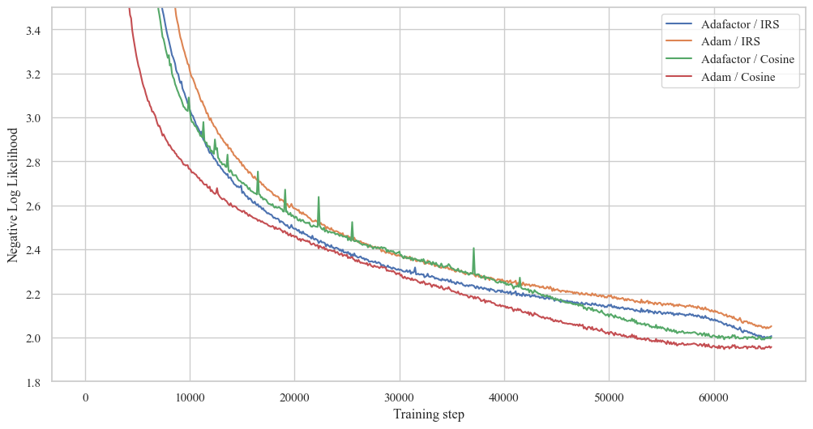
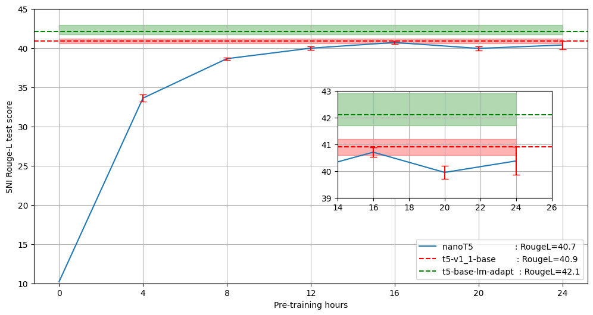
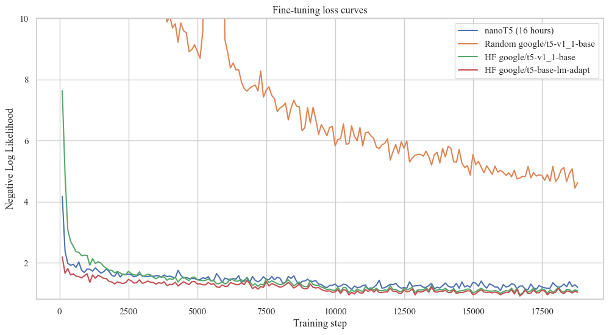

[](https://zenodo.org/badge/latestdoi/611282680)

# nanoT5 (Encoder-Decoder / Pre-training + Fine-Tuning)


[**TLDR**](#tldr) | [**Motivation**](#motivation) | [**Setup**](#setup) | [**Pre-training**](#pre-training) | [**Fine-tuning**](#fine-tuning) | [**Efficiency statistics**](#efficiency-statistics) | [**Extras**](#Extras) | [**Conclusions**](#conclusions) | [**References**](#references) | [**Issues**](#issues)

## TLDR:

This repository comprises the code to reproduce the pre-training of a "Large Language Model" (T5) under a limited budget (1xA100 GPU, < 24 hours) in PyTorch. We start from the randomly initialised T5-base-v1.1 (248M parameters) model, and we pre-train it on the English subset of the C4 dataset and then fine-tune it on Super-Natural Instructions (SNI) benchmark. 

**In ~16 hours on a single GPU, we achieve 40.7 RougeL on the SNI test set, compared to 40.9 RougeL of the original model weights available on HuggingFace Hub and pretrained on 150x more data through "a combination of model and data parallelism [...] on slices of Cloud TPU Pods", each with 1024 TPUs.**

Our core contribution is not the T5 model itself, which follows the HuggingFace implementation. Instead, we optimise everything else in the training pipeline to offer you a user-friendly starting template for your NLP application/research. Most importantly, we show that it is possible to pre-train the T5 model to a SOTA performance under a limited budget in PyTorch.

## Motivation

Despite the continuously increasing size of pretrained [Transformers](https://arxiv.org/pdf/1706.03762.pdf), the research community still needs easy-to-reproduce and up-to-date baselines to test new research hypotheses fast and at a small scale. 

A recent effort from Andrej Karpathy, the [nanoGPT](https://github.com/karpathy/nanoGPT) repository, enables researchers to pre-train and fine-tune GPT-style (Decoder-only) language models. On the other hand, [Cramming](https://github.com/JonasGeiping/cramming) opts to find the optimal BERT-style (Encoder-only) pre-training setup for limited-compute settings.

With [nanoT5](https://github.com/PiotrNawrot/nanoT5), we want to fill a gap (Community requests: [#1](https://github.com/huggingface/transformers/issues/18030) [#2](https://github.com/facebookresearch/fairseq/issues/1899) [#3](https://github.com/google-research/text-to-text-transfer-transformer/issues/172) [#4](https://discuss.huggingface.co/t/example-of-how-to-pretrain-t5/4129) [#5](https://github.com/huggingface/transformers/issues/5079)) of an accessible research template to pre-train and fine-tune T5-style (Encoder-Decoder) model. **To the best of our knowledge, it is the first attempt to reproduce T5 v1.1 pre-training in PyTorch (previously available implementations are in Jax/Flax).**

## 

**We created this repository for people who want to pre-train T5-style models by themselves and evaluate their performance on downstream tasks.** This could be for a variety of reasons:
- You are a researcher in academia with limited compute (like me), and you came up with a promising idea based on the T5 model, so you need a pipeline to evaluate it;
- You have an in-house dataset that you think is more appropriate than the original pre-training dataset (C4) for your downstream task;
- You want to experiment with continued pre-training or want to build on the T5 pre-training objective.

**If you don't need to pre-train the T5 model, you'd be better off downloading the weights from HuggingFace Hub. Our checkpoints are worse because we work under limited compute.**

## 

In this project, we expose (for research purposes) and optimise everything in the training pipeline of T5, except from the model implementation (though we include its simplified version). **Most importantly, we base our code on PyTorch, since access to TPUs is limited.** Key features:
- **Dataset:** Downloading and preprocessing of the C4 dataset happens in parallel with the training of the model. The C4 dataset is > 300GB, so it takes a couple of hours to download it and even longer to preprocess it. This codebase does it on the fly without any detrimental effect on the training time and performance (we haven't observed it, although it might happen with an old CPU (< 8 core) or a slow internet connection). **As a result, you can initiate pre-training of your own T5 model within minutes.**
- **Model Optimizer / LR Scheduler:** The original T5 uses a memory-efficient Adafactor optimizer. [A study on pre-training T5](https://huggingface.co/spaces/yhavinga/pre-training-dutch-t5-models), on the other hand, reports that training does not converge with AdamW. We analysed the source of this discrepancy with several ablations. Although there are many subtle differences between Adafactor and AdamW, what ensures the Adafactor convergence is [matrix-wise LR scaling by its root mean square (RMS)](https://github.com/huggingface/transformers/blob/main/src/transformers/optimization.py#L595). We augmented the AdamW implementation by RMS scaling and observed that it becomes **more stable during pre-training, achieves better validation loss, and is faster**.
- **Exposure and simplicity:** We try to balance the implementation of the training pipeline by keeping it customisable while retaining a sufficient level of abstraction. We use the [HuggingFace Accelerator](https://huggingface.co/docs/accelerate/index) to implement operations like Checkpoint Saving, Gradient Accumulation, Gradient Clipping, and moving tensors to the correct devices. We use [neptune.ai](https://neptune.ai) for experiment tracking and [hydra](https://hydra.cc/docs/intro/) for hyperparameters. Additionally, we expose a [simplified implementation](nanoT5/utils/t5_model.py) of the T5 model, training loop, data preprocessing, etc.
- **Efficiency:** We use mixed-precision training (TF32 & BF16), PyTorch 2.0 compile, and utilise all optimisations listed in established optimisation tutorials [#1](https://huggingface.co/docs/transformers/perf_train_gpu_one) [#2](https://pytorch.org/tutorials/recipes/recipes/tuning_guide.html).

## Setup

### Environment & Hardware:

```
git clone https://github.com/PiotrNawrot/nanoT5.git
cd nanoT5
conda create -n nanoT5 python=3.8
conda activate nanoT5
pip install -r requirements.txt
```

The following commands result in the following [pip freeze](assets/env_dump/pip_freeze.txt) as of 18.06.2023. 

We also include our [lscpu](assets/env_dump/lscpu.txt) and [nvidia-smi](assets/env_dump/nvidia_smi.txt).

## Pre-training:

### Reference:

The [T5 v1.1](https://arxiv.org/pdf/2002.05202.pdf) authors report **1.942** negative log-likelihood (NLL) on the held-out set of C4 after after 2^16 steps.

### Legacy Optimizer (Adafactor) & LR Schedule (Inverse-Square-Root)

We follow the original experimental setup for pre-training, including [Dataset (C4)](https://github.com/PiotrNawrot/nanoT5/blob/main/nanoT5/utils/model_utils.py#L58), [Training Objective (Span Filling)](https://github.com/PiotrNawrot/nanoT5/blob/main/nanoT5/utils/copied_utils.py#L16), [Model Architecture (T5-Base)](nanoT5/utils/t5_model.py), [Optimizer (Adafactor)](https://github.com/PiotrNawrot/nanoT5/blob/main/nanoT5/utils/model_utils.py#L236), and [LR Schedule (Inverse-Square-Root)](https://github.com/PiotrNawrot/nanoT5/blob/main/nanoT5/utils/model_utils.py#L276). 

Our negative log-likelihood on the held-out set is **1.995**, slightly worse than the reference.

### AdamW with RMS scaling Optimizer & Cosine LR Schedule

We also experiment with the AdamW optimizer (instead of the original Adafactor) as it (theoretically) should be more stable during training. Instead of using a low-rank approximation for the second moment of the gradients, it estimates it directly by storing the moving average for each parameter in a memory. However, training diverges with AdamW, similar to [this study on T5 pre-training](https://huggingface.co/spaces/yhavinga/pre-training-dutch-t5-models). Through several ablations, we found that [matrix-wise LR scaling by its root mean square (RMS)](https://github.com/huggingface/transformers/blob/main/src/transformers/optimization.py#L595) is responsible for the convergence of Adafactor. We augmented the AdamW implementation by RMS scaling and observed that [it converges, becomes more stable during pre-training and is slightly faster](assets/pt_loss.png) (it retrieves the second moment directly from memory instead of approximating it via matrix multiplications). 

However, AdamW, when paired with the Inverse-Square-Root LR schedule, performs worse than Adafactor. For our final experiment, we replace ISR with Cosine LR Schedule. We achieve **1.953** negative log-likelihood on the held-out set and significantly outperform Adafactor with ISR schedule. We consider this our best pre-training config.

### Training loss of runs with different optimisers (Adafactor vs AdamW) and schedulers (ISR vs Cosine). Rest of the [hyperparameters](nanoT5/configs/default.yaml) follows the original T5 v1.1 paper. 



### Negative log-likelihood on the held-out set of C4

<div align="center">

|       | **Inverse-Square-Root** | **Cosine**     |
| :---:        |    :----:   |          :---: | 
| **Adafactor**      | 1.995      |  1.993  |
| **AdamW**   | 2.040     |   **1.953**  |

</div>

### Examples

To reproduce any of the experiments mentioned above choose any combination of hyperparameters as follows:

```
python -m nanoT5.main \
    optim.name={adafactor,adamwscale} \
    optim.lr_scheduler={legacy,cosine}
```

We recommend adding `model.compile=true` flag for pre-training, if you are able to install PyTorch 2.0.

Suppose you don't have access to a 80GB GPU. In that case, you can increase the number of gradient accumulation steps by `optim.grad_acc=steps`, where `batch_size` has to be divisible by `steps`.

The summary of the optimization process is printed every 100 steps in the following format. For instance:

```
[train] Step 100 out of 65536 | Loss --> 59.881 | Grad_l2 --> 61.126 | Weights_l2 --> 7042.931 | Lr --> 0.010 | Seconds_per_step --> 1.385 |
```

[TODO: Include the default model weights] Finally, you can downlaod the weights after our pre-training directly from [HuggingFace Hub](https://huggingface.co/pnawrot/nanoT5-base) and fine-tune it directly on SNI using nanoT5.

### Efficiency statistics:

Below we include the efficiency statistics for our pre-training experiments. We report the time it takes to pre-train the model for 1 pre-training step and the total pre-training time according to the [default config](nanoT5/configs/default.yaml). Please note that we need to increase the **optim.grad_acc steps** to fit the model in precision different from BF16.

<div align="center">

| **Mixed Precision Format** | **Torch 2.0 compile** | **Grad Acc Steps** | **Pre-training (1 step)** | **Total Pre-training time** |
| :----: | :---: | :---: | :---: | :---: |
| FP32 | No | 2 | ~4.10s | ~74.6h |
| TF32 | No | 2 | ~1.39s | ~25.3h |
| BF16 | No | 2 | ~1.30s | ~23.7h |
| TF32 | Yes | 2 | ~0.95s | ~17.3h |
| BF16 | Yes | 1 | ~0.56s  | ~10.2h |

</div>

## Fine-tuning:

To fine-tune our model, we use the popular meta-dataset called **Super Natural-Instructions (SNI)**, which aggregates datasets for many tasks. This meta-dataset was used to fine-tune many of the recent LLMs, e.g. [FlanT5](https://arxiv.org/pdf/2210.11416.pdf), [BLOOM](https://arxiv.org/pdf/2211.05100.pdf), and [Tk-Instruct](https://arxiv.org/pdf/2204.07705.pdf). While FlanT5 and BLOOM use other corpora in addition to SNI, Tk-Instruct's pipeline consists of starting from the pre-trained T5 model and fine-tuning it solely on SNI. 

In this repository, we reproduce the Tk-Instruct fine-tuning results and use their pipeline to evaluate our pre-training config.

### Download the Super-Natural Instructions data:

```
git clone https://github.com/allenai/natural-instructions.git data
```

### Run fine-tuning:

We strictly follow the fine-tuning [config](nanoT5/configs/task/ft.yaml) of Tk-Instruct. It remains unclear whether Tk-Instruct was initialised from a regular checkpoint (*google/t5-v1_1-base*) or the one adapted explicitly for Language Modelling with continued training (*google/t5-base-lm-adapt*). Therefore, we decided to evaluate both. Run the following command to reproduce the Tk-Instruct experiments:

```
python -m nanoT5.main task=ft \
    model.name={google/t5-v1_1-base,google/t5-base-lm-adapt} \
    model.random_init={true,false} \
    model.klass={local_t5,hf_t5} \
    model.checkpoint_path={"","/path/to/pytorch_model.bin"}
```

`model.klass={local_t5,hf_t5}` differentiates between the simplified, and a bit faster, implementation of the T5 model in this repository and the original HuggingFace implementation. The former doesn't support loading weights from HuggingFace Hub, so you need to specify the path to the checkpoint. The latter supports both loading weights from HuggingFace Hub and from a local path. Both models share the same underlying architecture, and their checkpoints have the same format. During pre-training, we use the simplified implementation, while during fine-tuning, we stick to the HuggingFace implementation as it is more flexible and fast enough.

Setting `model.random_init=false model.klass=hf_t5 model.checkpoint_path=""` corresponds to downloading pre-trained weights from HuggingFace Hub.

Setting `model.random_init=false model.klass=local_t5 model.checkpoint_path="/path/to/pytorch_model.bin"` corresponds to using the weights [**pre-trained**](#pre-training) with nanoT5.

Setting `model.random_init=true model.klass=local_t5 model.checkpoint_path=""` corresponds to a random initialisation.

### Rouge-L on the held-out test-set across different pre-training budgets:

In the figure below, we compare the performance of our model trained within different time budgets ([4](nanoT5/configs/task/pt_4h.yaml), [8](nanoT5/configs/task/pt_8h.yaml), [12](nanoT5/configs/task/pt_12h.yaml), [16](nanoT5/configs/task/pt_16h.yaml), [20](nanoT5/configs/task/pt_20h.yaml), [24](nanoT5/configs/task/pt_24h.yaml) hours) with the original T5-base-v1.1 model weights available through Huggingface Hub and its version adapted for Language Modelling (*google/t5-base-lm-adapt*). We observe that model in our repository for 16 hours on a single GPU is only 0.2 RougeL worse on average than the original T5-base-v1.1 model, despite being pre-trained on 150x less data (According to the [T5 paper](https://arxiv.org/pdf/1910.10683.pdf), they pre-train their models for a millions steps with a batch size 2048. Our 16 hours config does 53332 steps with a batch size 256.). Configs to reproduce these experiments are available [here](nanoT5/configs/task/).



### Fine-tuning loss curves:



A single Fine-tuning step takes ~0.175s, and full Fine-tuning takes ~1 hour.

## Extras:

### Things we tried and didn't work out:

- **Different optimizers:** We tried the most recent optimizers like [Lion](https://arxiv.org/abs/2302.06675), [Sophia](https://github.com/Liuhong99/Sophia), however none of them worked better than AdamW with RMS scaling.
- **Positional embeddings:** We tried to replace T5's learned relative positional embeddings with [ALiBi](https://arxiv.org/pdf/2108.12409.pdf). Possible benefits include a reduction of parameters and faster training & inference. Furthermore, if ALiBi would work we could add [Flash Attention](https://github.com/HazyResearch/flash-attention) which supports only non-parametric bias. However, with ALiBi the training was less stable and it had worse pre-training loss.
- **FP16 precision:** All experiments with FP16 precision diverged across runs with different seeds

## Conclusions:

We show that it is possible to successfully pre-train a "Large Language Model" (T5) under a limited budget (1xA100 GPU, ~TODO hours) in PyTorch. We make our codebase, configs and training logs publicly available to enhance the accessibility of NLP research. We are keen to hear your suggestions to improve the codebase further.

### Acknowledgements:

Thanks to [Edoardo Maria Ponti](https://ducdauge.github.io) for his feedback!

## References:
- [T5 paper](https://arxiv.org/pdf/1910.10683.pdf)
- [T5 v1.1 paper](https://arxiv.org/pdf/2002.05202.pdf)
- [Super-Natural Instructions paper](https://arxiv.org/pdf/2204.07705.pdf)
- [HuggingFace Flax Script](https://github.com/huggingface/transformers/blob/main/examples/flax/language-modeling/run_t5_mlm_flax.py)
- [Karpathy's nanoGPT](https://github.com/karpathy/nanoGPT)
- [Instruct-GPT codebase (Super-Natural Instructions)](https://github.com/yizhongw/Tk-Instruct)
- [Blog about pre-training Dutch T5 in HuggingFace](https://huggingface.co/spaces/yhavinga/pre-training-dutch-t5-models)

## Issues:

If you have any questions, feel free to raise a Github issue or contact me directly at: piotr.nawrot@ed.ac.uk
